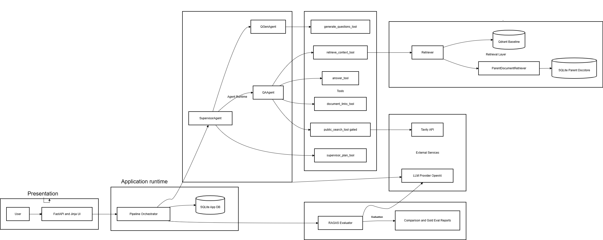

# Cert Challenge Submission

## Project
**Context Challengers PoC**

This document addresses Tasks 1-7 from the challenge rubric and reflects the current implementation in this repository.

Loom video: https://www.loom.com/share/1ebfa6640e0f44ee970b51846ba0871c
---

## Task 1: Defining the Problem, Audience, and Scope

### 1) One-sentence problem statement
Teams preparing internal documentation for chatbot use lack a fast, repeatable process to detect missing, ambiguous, contradictory, or weakly grounded information before release.

### 2) Why this is a problem for this user
The primary users are Knowledge Base Managers, QA teams, and AI Solutions Engineers who convert policy/product/service documentation into chatbot-ready knowledge. Their risk is not only incorrect answers, but also inconsistent behavior across documents, low evidence traceability, and hidden contradictions that manual review often misses.

Manual review is slow, subjective, and difficult to scale as documentation changes frequently. Late detection of quality issues reduces chatbot reliability, increases escalations to support teams, and lowers trust in automation. A pre-release validation workflow is required that is structured, auditable, and repeatable.

### 3) Evaluation questions / input-output pairs
Representative evaluation questions used in this project (from `goldendataset.json` and generated pipeline questions):

- When do new StreamPlus prices take effect?
- Do listed StreamPlus prices include VAT?
- Does annual inflation indexation apply?
- Through which channels can users recover StreamPlus accounts?
- What is the current status of re-registration/re-suspension issues?
- Which package tiers are explicitly listed?
- Which service categories are affected by the price change?
- When will the first invoices reflecting new pricing be issued?

Input-output pairs:

- Input: user uploads PDF/DOCX and starts pipeline.
- Output: chunked document, generated questions, QA results with evidence, classifications, and readiness score.

- Input: user opens document dashboard.
- Output: table of questions/answers with `problem_type`, `answer_confidence`, `classification_confidence`, evidence, suggested fixes, and reviewer exclusion controls.

- Input: user runs comparison/evaluation.
- Output: baseline vs parent RAGAS metrics and deltas.

---

## Task 2: Proposed Solution

### 1) Proposed solution
The solution is an Agentic RAG document-validation application. Users upload internal docs and run a supervised pipeline: extraction -> chunking -> question generation -> retrieval-grounded QA -> deterministic readiness scoring. The output is a dashboard that highlights problematic content before chatbot release, with evidence and remediation hints.

The system uses a LangChain tool-based orchestration layer with a SupervisorAgent and specialized agents (`QGenAgent`, `QAAgent`). Supervisor planning is LLM-assisted (configurable), while step execution remains deterministic and traceable through explicit dispatch. Retrieval supports both dense baseline and ParentDocumentRetriever paths for evaluation, with parent mode as the default in the main pipeline. External web search (Tavily) is strictly gated and only used as fallback when internal retrieval is weak and document signals permit it.

### 2) Infrastructure diagram + tooling choices



Tooling and rationale:

- LLM(s): OpenAI chat models for supervisor planning, question generation, QA, and RAGAS wrappers; single-provider setup improves consistency.
- Agent orchestration: LangChain toolized agents with explicit supervisor dispatch for control and observability.
- Tools: retrieval, QA analysis, and gated external-search tools separate responsibilities cleanly.
- Embeddings: `text-embedding-3-small` for consistent indexing/retrieval.
- Vector DB: Qdrant for baseline and parent-child retrieval vectors.
- Persistent state: SQLite for documents, chunks, questions, answers, exclusions, runs, and parent docstore.
- Monitoring: structured logs and pipeline status tracking.
- Evaluation: RAGAS for objective retrieval/answer quality measurement.
- UI: FastAPI + Jinja dashboards suitable for PoC review workflows.
- Deployment: local endpoint for demo scope.

### 3) Exact RAG and agent components
RAG components:

- Document extraction from uploaded PDF/DOCX.
- Chunking (`CHUNK_SIZE=1000`, `CHUNK_OVERLAP=200`) and parent/child splitting for advanced retrieval.
- Baseline dense retrieval on Qdrant.
- Parent retrieval with child vectors + SQLite parent docstore.
- QA grounded on retrieved evidence.
- RAGAS evaluation for baseline vs parent and gold-only CLI runs.

Agent components:

- `SupervisorAgent` (LLM-assisted planning + deterministic dispatch).
- `QGenAgent` (question generation).
- `QAAgent` (retrieval-grounded answer/classification).
- Tool layer in `app/pipeline/tools.py` with `@tool` definitions.

---

## Task 3: Data and External API

### 1) Default chunking strategy and rationale
Default chunking uses fixed-size chunks with overlap (`CHUNK_SIZE=1000`, `CHUNK_OVERLAP=200`). Overlap preserves continuity across boundaries and reduces context loss. Advanced retrieval uses parent/child splitters (`2000/200` parent, `400/50` child) to retrieve precisely while answering with richer parent context.

### 2) Data sources + external API + interaction
Data sources:

- Uploaded internal documents (PDF/DOCX).
- Evaluation dataset `goldendataset.json`.
- Template docs in `poc/templatedata/` for controlled benchmarking.

External API:

- Tavily Search API (`public_search_tool`) as gated fallback only.

Interaction flow:

1. User uploads a document.
2. Internal retrieval runs first.
3. QA answers from internal context and stores evidence.
4. External fallback is considered only when internal evidence is weak and document hints/URLs permit it.
5. Results are persisted and shown in dashboard.

---

## Task 4: End-to-End Prototype

### Implemented prototype scope (local)
The prototype is operational on a local endpoint and includes:

- Upload + extraction + chunking.
- Agentic pipeline orchestration (Supervisor -> QGen/QA via tools).
- Retrieval-grounded QA with evidence and split confidence fields.
- Main document dashboard with readiness KPI and reviewer exclusion loop.
- Comparison dashboard and run history.
- Delete actions for documents and comparison runs.
- Gold-only CLI evaluation path.

Run commands:

App:

```bash
uv run uvicorn app.main:app --reload
```

CLI gold eval:

```bash
uv run python -m app.cli.gold_eval --source-file templatedata/not_a_real_service_OK.docx --gold-file goldendataset.json --mode both --top-k 5 --output-json reports/gold_eval_topk5_detailed_refs.json
```

---

## Task 5: Baseline Evaluation with RAGAS

### 1) Setup
- Dataset: `goldendataset.json`
- Samples: 50
- Run mode: `both` (baseline + parent)
- Top-k: 5
- Required metrics: `faithfulness`, `context_precision`, `context_recall`
- Additional metrics: `factual_correctness`, `answer_relevancy`, `context_entity_recall`, `noise_sensitivity`

### 2) Results table (from `reports/gold_eval_topk5_detailed_refs.json`)

| Metric | Baseline | Parent | Delta (Parent - Baseline) |
|---|---:|---:|---:|
| context_recall | 0.860 | 0.857 | -0.003 |
| context_precision | 0.964 | 0.964 | +0.000 |
| faithfulness | 0.943 | 0.969 | +0.027 |
| factual_correctness | 0.465 | 0.503 | +0.038 |
| answer_relevancy | 0.756 | 0.785 | +0.030 |
| context_entity_recall | 0.696 | 0.632 | -0.063 |
| noise_sensitivity | 0.307 | 0.282 | -0.025 |

### 3) Conclusions
Both retrievers are useful but optimize different qualities. In this run, parent retrieval improved faithfulness, factual correctness, answer relevancy, and noise sensitivity (lower is better), while baseline had slightly better context recall and stronger entity recall. In repeated dashboard benchmarking for this use case, parent retrieval produced more stable QA behavior, so parent mode was selected as the default pipeline mode.

---

## Task 6: Advanced Retriever Upgrade

### 1) Chosen advanced retrieval technique + rationale
Advanced technique: `ParentDocumentRetriever` with parent/child chunking and persistent parent docstore.

Rationale: it retrieves via precise child chunks but returns larger parent context, which helps questions requiring nearby supporting facts across multiple lines/sections.

### 2) Implementation summary
Implemented with:

- Child vectors indexed in Qdrant.
- Parent docs persisted in SQLite docstore (not in-memory).
- Shared QA and RAGAS framework for fair baseline vs parent comparison.
- Parent retrieval set as default in main pipeline runs.

### 3) Performance comparison vs original
Comparison is quantified in Task 5. Parent improved several QA-quality metrics on the gold run, while baseline remained stronger on entity recall and marginally on context recall.

---

## Task 7: Next Steps
For demo scope, keep **parent retrieval as default** because it provides more stable, evidence-rich answer behavior in this use case. Keep **baseline dense retrieval available in comparison/evaluation runs** so improvements and regressions can be measured.

Planned improvements:

- Tighten question-generation constraints to reduce drift and over-specific questions and creating canonical set of questions.
- Strengthen reviewer feedback loop into intent-level suppression.
- Continue tuning retrieval thresholds and context-window rules per dataset.
- Add optional cross-document reference analysis.

---
